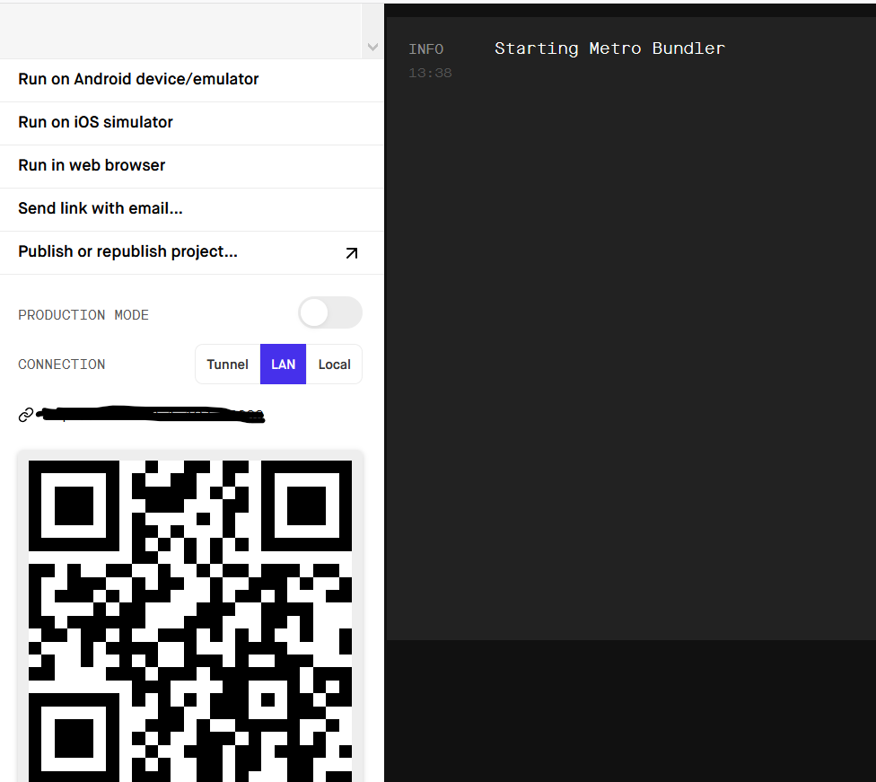

# Bluetooth beacons mobile

<!-- TABLE OF CONTENTS -->
## Table of Contents

* [About the Project](#about-the-project)
  * [Built With](#built-with)
* [Getting Started](#getting-started)
  * [Prerequisites](#prerequisites)
  * [Installation](#installation)
* [How to use](#how-to-use)
  * [Mobile client](#mobile-client)
  * [Logic](#logic)
* [Known issues and future developments](#known-issues-and-future-developments)
* [License](#license)


<!-- ABOUT THE PROJECT -->
## About the project

***
#### Bluetooth beacons:
 https://github.com/Vanhusmonitorointiprojekti/Bluetooth_beacons
***


The purpose of the project is to support the residents of a nursing home under construction that are suffering from memory disorders to live more independently in safety. 
The project consists of different sections, which are described in more detail in the repository [Bluetooth Beacons](https://github.com/Vanhusmonitorointiprojekti/Bluetooth_beacons).

The residents will be wear ing bluetooth wristlets that send signals that are tracked by Raspberry Pis installed inside the nursing facility.

An application has been made in this repository, through which users, ie caregivers, can see the locations of residents and receive an alarm notification on the phone when a resident has moved to an area that is not safe due to a memory disorder.


This is the mobile version of Bluetooth_beacons that can be found here: https://github.com/Vanhusmonitorointiprojekti/Bluetooth_beacons_mobile
This version uses the same backend node server that the web version uses.
***
#### Bluetooth beacons mobile:
 https://github.com/Vanhusmonitorointiprojekti/Bluetooth_beacons_mobile
***
### Built With

* [React Native](https://reactnative.dev/)
* [Expo](https://docs.expo.io/)
* [Socket.io](https://socket.io/)
* [Node.js](https://nodejs.org/en/)


<!-- GETTING STARTED -->
## Getting Started

---
Make sure that you have installed:
* node.js
* and Expo CLI

You can install node from here: https://nodejs.org/en/

To view a project you must have an Expo CLI server running for that project:

1. Expo CLI

    * Run the following command on the terminal or command-line tool to install expo CLI globally:

    ```sh 
      npm install --global expo-cli
    ```
2. Expo client app

    * Download and install the expo client from the app store using your mobile device.
    * Expo opens Metro Bundler in your browser after you run your app.

    * Scan QR code from the expo development tool and then the app will open in your mobile device



You can find Expo installation instructions here: https://docs.expo.io/get-started/installation/

### Prerequisites


Clone the project:
```sh
git clone https://github.com/Vanhusmonitorointiprojekti/Bluetooth_beacons_mobile.git
```
```sh
 cd Bluetooth_beacons_mobile
 ```


### Installation

* Install all required libraries by running `npm install`
* **Front-end:**

  Start front-end by opening another terminal and navigating to application folder:

   
       .\Bluetooth_beacons_mobile
    

  & run start:

  ```sh
  expo start
  ```
  Follow on screen expo directions to launch the app on the device of your choice.

* For the app to run succesfully using the expo's built in emulator the app requires the user to enter their Ipv4 address to files inside the pages folder.:
    * locations_info.js
    * asukastietoja.js
    * hälytys.js 
    * and also App.js
    
   Here is an example of the required code to be modified.
   
         useEffect (() => {
           let newArray = []
            Put your Ipv4 address here for example http://000.000.0.0:4000/statuses
        axios.get('http://000.000.0.0:4000/statuses')
          .then((response) => {
                setTieto(response.data)
                newArray = response.data
        })
        console.log('tieto alussa', tieto)
        // Put your Ipv4 address here for example http://000.000.0.0:4002
        const socket = socketIOClient("http://000.000.0.0:4002");
        
        socket.on("updates", async data =>  {
            console.log('update', data)
            newArray = await newArray.filter(t => t.tenant_id !== data.tenant_id).concat(data)        
            console.log('newArray', newArray)
            await setTieto(newArray)           
        });

* **Backend:**  [more info about installation](https://github.com/Vanhusmonitorointiprojekti/Bluetooth_beacons#installation)

    How to start monitoring server:

    
      .\Bluetooth_beacons\src\realtime_db
   
      node monitorserver.js

  Start RethinkDB server in another terminal window (in the folder where you created the rethinkdb_data folder)

      rethinkdb


   * If program starts with infotext "Socket.io is running on port "... your installation is succesful.
   * If there is problem with some library for example axios, install the required library: `npm install axios`


* Both backend and frontend should be running in order for the application to work.

<!-- How to use -->
## How to use

<!-- mobile client -->
### Mobile client

**Asukastiedot**

 Client info page shows client information like name, home details and beacon info


**Asukassijainnit**

Beacon locations is the main page of the application and it shows if becons have been detected outside the green zone.


**Hälytykset**

This is the screen where the nurse can check out the alarm:


When the "Kuittaa hälytys" -button is pressed, it will send the tenant id and the information that the nurse has checked the situation that has caused the alarm to the backend server.

```sh
const sendTenantID = async(data) =>{
      let checked = true
      const req = await axios.put(`${PUSH_ENDPOINT}/${data}`, { checked })    
  }
```

If there aren´t any alarms the screen looks like this:


<!-- Logic -->
### Technical description

 App has been created using react native and expo. It uses react native's useEffect to fetch data from the node backend and socketio to keep fetching the data.
 
 For a more detailed description of the logic and for the backend details check Bluetooth beacons repository.

 ### Push Notifications

 When the app is opened, few things are happening in the background:
 
* is the app running on device or on an emulator:
```sh 
if (Constants.isDevice) 
  ```
* permission is asked to send push notifications 
```sh 
const { status: existingStatus } = await Permissions.getAsync(Permissions.NOTIFICATIONS);
      let finalStatus = existingStatus;
      if (existingStatus !== 'granted') {
        const { status } = await Permissions.askAsync(Permissions.NOTIFICATIONS);
        finalStatus = status;
      }
      if (finalStatus !== 'granted') {
        alert('Failed to get push token for push notification!');
        return;
      }
   ```
* obtaining the Expo push token
```sh 
token = (await Notifications.getExpoPushTokenAsync()).data;
      console.log(token);
    } else {
      alert('Must use physical device for Push Notifications');
    }
```
* posting it to the backend server
```sh 
fetch(PUSH_ENDPOINT, {
      method: 'POST',
      headers: {
        Accept: 'application/json',
        'Content-Type': 'application/json',
      },
      body: JSON.stringify({
        token
    
      }),
    });
    console.log('post token', token)
    return token;
  }
```
If there are any problems to get push token, try to login into your Expo Dev Tools:
```sh
expo login  *
```
(*before that, you need to create a profile)

Backend sending notification when client is in the area that is forbidden for him/her


<!-- Known issues and future developments -->
## Known issues and future developments

See the [open issues](https://github.com/Marski96/Bluetooth_beacons_mobile/issues) for a list of proposed features (and known issues).

<!-- License -->
## License
Licensed under MIT -license.
https://opensource.org/licenses/MIT
